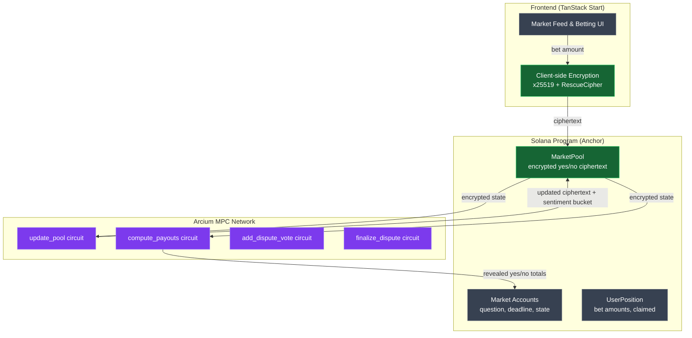
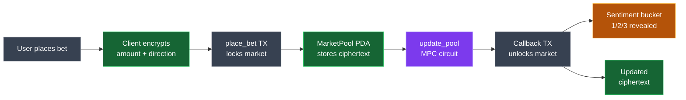

# Phase 10: RTG Submission - Research

**Researched:** 2026-03-05
**Domain:** Open-source preparation, technical documentation, demo materials for hackathon submission
**Confidence:** HIGH

## Summary

Phase 10 is a documentation and packaging phase -- no new application code is written. The work involves three streams: (1) repository cleanup for open-source release (LICENSE file, .gitignore updates, secrets scan, package.json metadata), (2) README rewrite to tell the Arcium-focused story with Mermaid architecture diagrams, and (3) demo screenshots embedded in the README showcasing the fog privacy UX.

The existing codebase is already well-structured with clean phase-based commit history (212 commits across 12 phases). The current README has solid developer-facing content that serves as a foundation. The main work is narrative -- transforming technical documentation into a compelling RTG submission that naturally addresses all five judging criteria (Innovation, Technical Implementation, User Experience, Impact, Clarity) without explicitly labeling them.

**Primary recommendation:** Lead with the herding problem narrative, use two Mermaid diagrams (system overview + encrypted data flow) with color-coded encrypted vs. plaintext nodes, embed 3-4 fog UX screenshots, and keep the existing developer getting-started section intact below the RTG narrative.

<user_constraints>
## User Constraints (from CONTEXT.md)

### Locked Decisions
- **README narrative**: Problem-first hook leading with herding problem in prediction markets, then Arcium MPC as the solution
- **Arcium explanation style**: Conceptual with highlights -- high-level encrypted state relay explanation, 1-2 circuit code snippets, link to source for the rest
- **Getting-started section**: Keep existing content as-is below the RTG narrative
- **RTG criteria integration**: Weave naturally through narrative, no explicit criterion labels as section headers
- **Architecture diagrams**: Mermaid.js rendered inline by GitHub, two-diagram approach (system overview + encrypted data flow)
- **Diagram scope**: Both Arcium showcases -- encrypted betting flow (update_pool, compute_payouts) AND encrypted dispute flow (add_dispute_vote, finalize_dispute)
- **Demo materials**: Screenshots embedded in README as primary, optional video walkthrough
- **Screenshot focus**: 3-4 fog-focused highlights (fog over encrypted pools, fog over sentiment, fog-clear animation before/after, dispute fog)
- **License**: MIT
- **Repo cleanup**: Exclude .planning/ from public repo via .gitignore, keep commit history as-is, quick secrets scan before going public

### Claude's Discretion
- Visual approach for encrypted vs plaintext distinction in Mermaid diagrams (color-coded vs label-based)
- Screenshot storage location in repo (docs/screenshots/ vs assets/ vs .github/)
- Whether to use mock data or live devnet data for screenshots (mock likely more practical given DKG blocker)
- Exact README section ordering and flow

### Deferred Ideas (OUT OF SCOPE)
None -- discussion stayed within phase scope
</user_constraints>

<phase_requirements>
## Phase Requirements

| ID | Description | Research Support |
|----|-------------|-----------------|
| RTG-01 | Open-source GitHub repository with clear documentation | MIT LICENSE file, .gitignore update for .planning/, secrets scan with grep-based patterns (gitleaks not installed), package.json license field update |
| RTG-02 | README explains what's encrypted, why it matters, and how Arcium enables it | Problem-first narrative structure, encrypted state relay pattern explanation, circuit code snippets from encrypted-ixs/src/lib.rs, two Arcium showcases (betting + disputes) |
| RTG-03 | Architecture diagram showing encrypted vs. plaintext data flow | Two Mermaid diagrams with classDef color-coding -- green for encrypted, standard for plaintext. GitHub renders mermaid code blocks natively |
</phase_requirements>

## Standard Stack

### Core

| Tool | Version | Purpose | Why Standard |
|------|---------|---------|--------------|
| Mermaid.js | GitHub-native | Architecture diagrams rendered inline in markdown | Version-controlled, no external tools needed, GitHub renders natively in code blocks |
| MIT License | N/A | Open-source license file | User decision; most permissive, largest share of all licensed GitHub projects |
| gitleaks / grep | N/A | Secrets scanning before open-sourcing | Industry standard for pre-public audits |

### Supporting

| Tool | Purpose | When to Use |
|------|---------|-------------|
| `grep -rn` patterns | Secrets scan fallback | Since gitleaks and trufflehog are not installed locally, use targeted grep patterns for common secret formats |
| GitHub's markdown renderer | Mermaid diagram preview | Test diagrams at mermaid.live before committing, GitHub renders identically |

### Alternatives Considered

| Instead of | Could Use | Tradeoff |
|------------|-----------|----------|
| Mermaid inline diagrams | Static PNG/SVG images | Mermaid is version-controlled and editable; images require external tools and are harder to maintain |
| grep-based secrets scan | gitleaks via `brew install gitleaks` | gitleaks is more thorough but requires installation; grep covers the common patterns (private keys, API keys) mentioned in CONTEXT.md |
| Screenshots in README | Loom/YouTube demo video | Screenshots load instantly, no external dependency; video is optional enhancement |

**Installation:**
```bash
# No new packages needed for this phase
# Optional: install gitleaks for thorough secrets scanning
brew install gitleaks
```

## Architecture Patterns

### Recommended File Structure

```
avenir/
├── LICENSE                    # NEW: MIT license file
├── README.md                  # REWRITE: RTG-focused narrative + existing getting-started
├── docs/
│   └── screenshots/           # NEW: 3-4 fog UX screenshots
│       ├── market-feed-fog.png
│       ├── encrypted-sentiment.png
│       ├── fog-reveal-resolved.png
│       └── dispute-fog.png
├── .gitignore                 # UPDATE: add .planning/
├── package.json               # UPDATE: license field ISC -> MIT
└── (all existing code unchanged)
```

### Pattern 1: Mermaid Diagram with classDef Color Coding

**What:** Use Mermaid `classDef` to visually distinguish encrypted (green/emerald) vs plaintext (default gray) data flows in architecture diagrams.

**When to use:** Both diagrams -- system overview and encrypted data flow.

**Example (system overview diagram):**


**Key Mermaid syntax notes for GitHub:**
- Use triple-backtick code blocks with `mermaid` language identifier
- `classDef` with `fill`, `stroke`, `color` properties works on GitHub
- Use `:::className` inline syntax on node definitions
- Subgraphs with quoted titles: `subgraph Name ["Display Title"]`
- Avoid font-awesome icons (not supported on GitHub)
- Avoid tooltips (not supported on GitHub)
- Test at mermaid.live before committing

### Pattern 2: Problem-First README Narrative

**What:** Structure the README as a story: Problem -> Solution -> How It Works -> Proof.

**When to use:** The entire README rewrite.

**Structure:**
1. **Hook**: The herding problem in prediction markets (1-2 paragraphs)
2. **Solution**: What Avenir does differently with encrypted pools (1 paragraph)
3. **How It Works**: Two showcases with Mermaid diagrams
   - Encrypted betting pools (update_pool, compute_payouts)
   - Encrypted dispute voting (add_dispute_vote, finalize_dispute)
4. **The UX**: Fog metaphor with embedded screenshots
5. **Under the Hood**: Circuit code snippet highlights (1-2 from `encrypted-ixs/src/lib.rs`)
6. **Getting Started**: Existing developer content (preserved as-is)
7. **License**: MIT

### Pattern 3: Screenshot Embedding in GitHub Markdown

**What:** Use relative markdown image syntax to embed screenshots stored in `docs/screenshots/`.

**When to use:** The demo materials section of README.

**Example:**
```markdown

*Live market cards with fog gradients obscuring pool totals and sentiment data*
```

**Notes:**
- GitHub renders PNG/JPG from relative paths in the same repo
- Keep images under 5MB each (GitHub raw file limit is 100MB)
- Use descriptive alt text for accessibility and judge readability
- Italic caption below each image provides context

### Anti-Patterns to Avoid

- **Criterion-labeled sections:** Don't use "Innovation", "Technical Implementation", etc. as section headers. Weave these naturally through the narrative per user decision.
- **Wall-of-code README:** Don't dump entire circuit files. Highlight 1-2 circuits with key lines, link to source for the rest.
- **External diagram hosting:** Don't use draw.io, Figma exports, or other external tools. Mermaid stays version-controlled.
- **Replacing developer docs:** Don't remove the existing getting-started section. Prepend the RTG narrative above it.

## Don't Hand-Roll

| Problem | Don't Build | Use Instead | Why |
|---------|-------------|-------------|-----|
| Architecture diagrams | Static PNG images in image editor | Mermaid.js inline in markdown | Version-controlled, editable, renders natively on GitHub |
| Secrets scanning | Manual file-by-file review | grep patterns or gitleaks | Automated scanning catches patterns humans miss across 212 commits |
| License text | Writing custom license text | Standard MIT template from choosealicense.com | Legal precision matters; standard templates are legally vetted |

**Key insight:** This phase is entirely about packaging existing work, not building new features. Every artifact (LICENSE, README, screenshots, .gitignore) uses standard templates or tools.

## Common Pitfalls

### Pitfall 1: Mermaid Diagrams Breaking on GitHub

**What goes wrong:** Mermaid diagrams render locally or on mermaid.live but break or render differently on GitHub.
**Why it happens:** GitHub uses a specific Mermaid version and rendering pipeline. Some features (font-awesome, tooltips, click events) are not supported. Special characters in labels can cause parse errors.
**How to avoid:** (1) Test diagrams at mermaid.live first, (2) Use quoted labels for text with special characters, (3) Avoid unsupported features, (4) Keep diagrams simple -- complex nested subgraphs can cause layout issues.
**Warning signs:** Diagram renders as raw text instead of image on GitHub.

### Pitfall 2: Secrets Leaked in Git History

**What goes wrong:** Sensitive data (Solana keypairs, API keys) committed in earlier phases remain in git history even if removed from current files.
**Why it happens:** `git rm` removes from working tree but not history. Going public exposes entire history.
**How to avoid:** (1) Run secrets scan across ALL commits, not just current HEAD, (2) Check Anchor.toml wallet path (currently `~/.config/solana/id.json` -- this is a path reference, not a key itself, which is fine), (3) Scan for base58-encoded private key patterns.
**Warning signs:** grep returning matches in `git log -p` output.

### Pitfall 3: .planning/ Directory Exposed

**What goes wrong:** Internal planning documents, context files, and state files become part of the public repository.
**Why it happens:** .planning/ not in .gitignore, files already tracked by git.
**How to avoid:** (1) Add `.planning/` to .gitignore, (2) Remove from git tracking with `git rm -r --cached .planning/`, (3) Commit the removal BEFORE going public.
**Warning signs:** `git ls-files .planning/` returns files after adding to .gitignore.

### Pitfall 4: Screenshots from Wrong State

**What goes wrong:** Screenshots show broken UI, loading states, or missing data that undermines the demo.
**Why it happens:** App depends on Solana localnet/devnet with Arcium DKG (currently non-functional on devnet). Without live MPC, encrypted flows don't work.
**How to avoid:** Use mock data mode or carefully capture screenshots from the existing mock data flow. The app already has 10 mock markets with diverse states. Capture from development server (`bun run dev` in app/).
**Warning signs:** Screenshots showing "Encrypted" text with no fog overlay, or error states.

### Pitfall 5: Package.json License Mismatch

**What goes wrong:** LICENSE file says MIT but package.json still says ISC. Inconsistent signals to automated tools and judges.
**Why it happens:** Overlooking the package.json `license` field when adding LICENSE file.
**How to avoid:** Update package.json `"license"` from `"ISC"` to `"MIT"` in the same commit as the LICENSE file.
**Warning signs:** `npm pack --dry-run` or GitHub's license detection showing different license.

## Code Examples

### MIT License File Template

```
MIT License

Copyright (c) 2026 [Author Name]

Permission is hereby granted, free of charge, to any person obtaining a copy
of this software and associated documentation files (the "Software"), to deal
in the Software without restriction, including without limitation the rights
to use, copy, modify, merge, publish, distribute, sublicense, and/or sell
copies of the Software, and to permit persons to whom the Software is
furnished to do so, subject to the following conditions:

The above copyright notice and this permission notice shall be included in all
copies or substantial portions of the Software.

THE SOFTWARE IS PROVIDED "AS IS", WITHOUT WARRANTY OF ANY KIND, EXPRESS OR
IMPLIED, INCLUDING BUT NOT LIMITED TO THE WARRANTIES OF MERCHANTABILITY,
FITNESS FOR A PARTICULAR PURPOSE AND NONINFRINGEMENT. IN NO EVENT SHALL THE
AUTHORS OR COPYRIGHT HOLDERS BE LIABLE FOR ANY CLAIM, DAMAGES OR OTHER
LIABILITY, WHETHER IN AN ACTION OF CONTRACT, TORT OR OTHERWISE, ARISING FROM,
OUT OF OR IN CONNECTION WITH THE SOFTWARE OR THE USE OR OTHER DEALINGS IN THE
SOFTWARE.
```
Source: https://choosealicense.com/licenses/mit/

### Mermaid Encrypted Data Flow Diagram (for Betting)



### Grep-Based Secrets Scan (gitleaks fallback)

```bash
# Scan current files for common secret patterns
grep -rn --include="*.ts" --include="*.tsx" --include="*.json" --include="*.toml" --include="*.rs" \
  -E '(PRIVATE_KEY|SECRET_KEY|API_KEY|private_key|secret_key|api_key|-----BEGIN)' .

# Scan git history for leaked secrets (all commits)
git log -p --all -S 'PRIVATE_KEY' --diff-filter=A
git log -p --all -S 'BEGIN PRIVATE' --diff-filter=A
git log -p --all -S 'secret' --diff-filter=A -- '*.env' '*.json' '*.toml'

# Check for .env files that might have been committed
git log --all --diff-filter=A -- '*.env' '.env*'

# Verify Anchor.toml wallet reference is a path, not an inline key
grep -n 'wallet' Anchor.toml
# Expected: wallet = "~/.config/solana/id.json" (path reference, safe)
```

### .gitignore Addition for .planning/

```gitignore
# Planning docs (internal only)
.planning/
```

**Critical note:** Since .planning/ is already tracked by git, adding to .gitignore alone won't remove it. Must also run:
```bash
git rm -r --cached .planning/
git commit -m "chore: remove .planning/ from tracking"
```

### README Circuit Code Snippet (update_pool highlight)

From `encrypted-ixs/src/lib.rs`, the `update_pool` circuit is the best candidate for a README code highlight because it demonstrates:
1. Encrypted input from user (`Enc<Shared, BetInput>`)
2. Encrypted state from chain (`Enc<Mxe, PoolTotals>`)
3. Computation on encrypted values (pool total update)
4. Selective reveal (sentiment bucket only, not pool amounts)

```rust
#[instruction]
pub fn update_pool(
    bet_ctxt: Enc<Shared, BetInput>,
    pool_ctxt: Enc<Mxe, PoolTotals>,
) -> (Enc<Mxe, PoolTotals>, u8) {
    let bet = bet_ctxt.to_arcis();
    let mut pool = pool_ctxt.to_arcis();

    if bet.is_yes {
        pool[0] += bet.amount;
    } else {
        pool[1] += bet.amount;
    }

    // Sentiment: multiplication-based comparison (no expensive division)
    let total = pool[0] + pool[1];
    let sentiment: u8 = if pool[0] * 2 > total {
        1 // Leaning Yes
    } else if pool[1] * 2 > total {
        3 // Leaning No
    } else {
        2 // Even
    };

    (pool_ctxt.owner.from_arcis(pool), sentiment.reveal())
}
```

## State of the Art

| Old Approach | Current Approach | When Changed | Impact |
|--------------|------------------|--------------|--------|
| Static diagram images (PNG/SVG) | Mermaid inline in GitHub markdown | GitHub added native Mermaid support (Feb 2022) | Diagrams are version-controlled, editable, no external tools |
| Manual license file creation | GitHub license picker + choosealicense.com templates | Long-standing | Legally vetted standard text, auto-detected by GitHub |
| Manual secrets review | Automated scanning (gitleaks, trufflehog) | gitleaks v8+ (2023) | 800+ credential patterns detected automatically |

**Deprecated/outdated:**
- Using external Mermaid renderers or GitHub Actions to convert mermaid to images -- GitHub renders natively now
- Putting screenshots in root directory -- `docs/` subdirectory is the established convention

## Open Questions

1. **Screenshot capture method**
   - What we know: The app has 10 mock markets with diverse states. The dev server runs at localhost:3000.
   - What's unclear: Whether the fog animations and overlays look correct with mock data alone, since MPC callbacks are simulated.
   - Recommendation: Manually capture screenshots from the running dev server. The FogOverlay component works purely on the `revealed` prop -- mock data with `state: 0` (Open) will show fog, and `state: 4` (Finalized) will show revealed state. This should work correctly.

2. **Author name for LICENSE file**
   - What we know: MIT license requires `Copyright (c) [year] [fullname]`.
   - What's unclear: Whether to use personal name, project name ("Avenir"), or organization name.
   - Recommendation: Use the repository owner's name. The planner should leave a placeholder for the user to fill in.

3. **Whether to remove .planning/ from git history entirely**
   - What we know: User decision is to exclude .planning/ from public repo via .gitignore.
   - What's unclear: Whether "exclude" means just .gitignore (files stay in history) or full history rewrite (git filter-branch/BFG).
   - Recommendation: Use `git rm -r --cached .planning/` + .gitignore addition. This removes from future tracking while preserving history. Full history rewrite is destructive and unnecessary since .planning/ contains no secrets.

## Sources

### Primary (HIGH confidence)
- GitHub Docs: Creating diagrams - https://docs.github.com/en/get-started/writing-on-github/working-with-advanced-formatting/creating-diagrams
- Choose a License (MIT): https://choosealicense.com/licenses/mit/
- Mermaid.js Flowchart Syntax: https://mermaid.ai/open-source/syntax/flowchart.html
- GitHub Blog: Include diagrams with Mermaid - https://github.blog/developer-skills/github/include-diagrams-markdown-files-mermaid/
- Direct codebase inspection: encrypted-ixs/src/lib.rs (6 circuits), app/src/components/fog/FogOverlay.tsx, existing README.md, .gitignore, package.json, Anchor.toml

### Secondary (MEDIUM confidence)
- Gitleaks GitHub repository: https://github.com/gitleaks/gitleaks
- TruffleHog GitHub repository: https://github.com/trufflesecurity/trufflehog
- Mermaid GitHub examples gist: https://gist.github.com/ChristopherA/bffddfdf7b1502215e44cec9fb766dfd
- GitHub Docs: Adding a license - https://docs.github.com/en/communities/setting-up-your-project-for-healthy-contributions/adding-a-license-to-a-repository

### Tertiary (LOW confidence)
- Arcium RTG evaluation criteria (inferred from PROJECT.md context: Innovation, Technical Implementation, User Experience, Impact, Clarity) -- specific scoring rubric not publicly documented

## Metadata

**Confidence breakdown:**
- Standard stack: HIGH - Mermaid is natively supported by GitHub (verified via official docs), MIT license is standard template
- Architecture: HIGH - Diagram patterns verified against Mermaid docs and GitHub rendering examples, README structure follows established open-source conventions
- Pitfalls: HIGH - .planning/ removal, secrets scanning, and mermaid rendering issues are well-documented; verified against codebase state (no secrets found in current files, .planning/ exists in tracking, Anchor.toml wallet is path reference)

**Research date:** 2026-03-05
**Valid until:** 2026-04-05 (stable domain -- documentation and licensing patterns change slowly)
