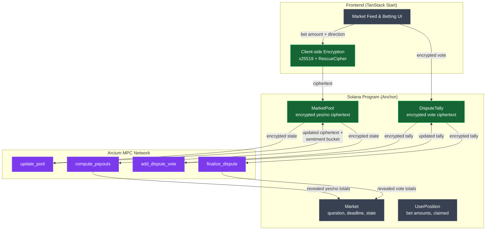
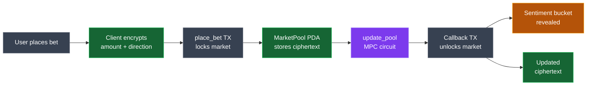

# Avenir

**Encrypted prediction markets on Solana, powered by [Arcium](https://arcium.com) MPC.**

Avenir is a prediction market protocol where all bet amounts, pool totals, and dispute votes are encrypted using multi-party computation. No one -- not validators, not other users, not even the protocol -- can see individual positions or pool sizes. Only a coarse sentiment signal is revealed until the market resolves.

## The Problem: Herding Kills Signal

Prediction markets work because they aggregate independent beliefs into a price signal. The accuracy of that signal depends on participants expressing what they genuinely think, not what they think everyone else thinks.

On platforms like Polymarket, the current odds are visible to everyone. When a user sees "Yes" trading at 72%, they anchor to that number. Undecided participants follow the crowd. Whales exploit this by placing large, visible bets to shift odds and trigger cascade betting in their favor. The result is a Keynesian beauty contest: participants stop predicting the outcome and start predicting each other's predictions. The very transparency that makes prediction markets feel trustworthy is what corrupts their signal.

## The Solution: Encrypt Everything

Avenir eliminates herding by encrypting the data that enables it. Every bet placed on Avenir is encrypted client-side using x25519 key exchange and processed through Arcium's multi-party computation network. Pool totals are stored on-chain as ciphertext that no single party can decrypt.

Instead of exact odds, participants see only a coarse **sentiment bucket** -- Leaning Yes, Even, or Leaning No -- computed inside the MPC circuit and selectively revealed. This gives enough signal to know a market is active without exposing the information that drives herd behavior. At resolution, pool totals are decrypted and winners receive proportional USDC payouts.

## How It Works -- Architecture Overview



> **Legend**: Green = encrypted data (never visible as plaintext during market lifecycle) | Gray = plaintext data (publicly readable on-chain) | Purple = MPC computation (runs inside Arcium's multi-party network)

## Encrypted Betting Flow

When a user places a bet, the amount and direction never touch the blockchain as plaintext. Here is the step-by-step lifecycle:



This design enforces two key privacy properties:

- **Anti-herding**: No one sees which side is winning, so bettors express genuine beliefs rather than following the crowd. The only public signal is a coarse sentiment bucket (Leaning Yes / Even / Leaning No) that reveals direction without magnitude.
- **Anti-manipulation**: Whales cannot signal their position size to influence others. A $100,000 bet and a $10 bet both look the same on-chain -- encrypted ciphertext with no visible amount.

## Encrypted Dispute Resolution

When a market's resolution is contested, Avenir uses the same encryption pattern for dispute voting. Jurors are selected deterministically from staked resolvers and cast encrypted ballots weighted by their stake.

No juror can see how others have voted -- this prevents jury herding, where early votes anchor later ones. The encrypted tally accumulates inside the MPC network, and only the aggregate outcome (total yes-weighted vs. no-weighted votes) is revealed at finalization. This gives the dispute system the same independent-judgment guarantee as the betting pools: each juror votes their honest assessment without social pressure.

## Under the Hood -- Circuit Highlights

Avenir's privacy is implemented through six Arcium MPC circuits defined in [`encrypted-ixs/src/lib.rs`](encrypted-ixs/src/lib.rs). The core circuit is `update_pool`, which processes each encrypted bet:

```rust
#[instruction]
pub fn update_pool(
    bet_ctxt: Enc<Shared, BetInput>,  // User's bet, encrypted with their x25519 shared secret
    pool_ctxt: Enc<Mxe, PoolTotals>,  // Pool state, encrypted by the MPC network
) -> (Enc<Mxe, PoolTotals>, u8) {
    let bet = bet_ctxt.to_arcis();
    let mut pool = pool_ctxt.to_arcis();

    // Update pool totals based on bet direction
    if bet.is_yes {
        pool[0] += bet.amount; // yes_pool
    } else {
        pool[1] += bet.amount; // no_pool
    }

    // Compute sentiment bucket using multiplication (no expensive division)
    let total = pool[0] + pool[1];
    let sentiment: u8 = if pool[0] * 2 > total {
        1 // Leaning Yes
    } else if pool[1] * 2 > total {
        3 // Leaning No
    } else {
        2 // Even
    };

    // Return updated pool as MXE-encrypted, sentiment as revealed plaintext
    (pool_ctxt.owner.from_arcis(pool), sentiment.reveal())
}
```

Key details:

- **`Enc<Shared, BetInput>`** -- The user's bet encrypted with their x25519 shared secret. Only the MPC network can decrypt it during computation.
- **`Enc<Mxe, PoolTotals>`** -- The pool state encrypted by the MPC network itself. Stored on-chain as ciphertext that no single party controls.
- **`sentiment.reveal()`** -- Selective declassification. Only the coarse sentiment bucket (1, 2, or 3) exits the MPC circuit as plaintext. The actual pool amounts stay encrypted.

The remaining circuits follow the same pattern: `compute_payouts` reveals pool totals at resolution, `add_dispute_vote` accumulates encrypted ballots, and `finalize_dispute` reveals vote totals. See the [full source](encrypted-ixs/src/lib.rs) for all six circuits.

## The UX -- Fog of Prediction

Encrypted data creates a UX challenge: how do you show users that information exists without revealing it? Avenir solves this with a **fog metaphor**. Encrypted pool totals and sentiment data are wrapped in animated fog gradient overlays that visually communicate "this data is hidden."

When a market resolves and pool totals are decrypted, the fog clears with an animation revealing the true numbers underneath. The transition from obscured to clear reinforces the privacy story -- users experience the moment encryption ends.


*Live market cards with fog gradients obscuring encrypted pool totals and sentiment data*


*Market detail view showing the coarse sentiment signal wrapped in fog -- users know the direction but not the magnitude*


*A resolved market with fog cleared -- true pool totals and final odds are now visible*


*Dispute view with fog over the encrypted vote tally -- jurors cannot see how others have voted*

## Getting Started

### Prerequisites

- [Rust](https://rustup.rs/) (toolchain `1.93.0`, managed via `rust-toolchain.toml`)
- [Solana CLI](https://docs.solana.com/cli/install-solana-cli-tools)
- [Anchor CLI](https://www.anchor-lang.com/docs/installation) `0.32.1`
- [Arcium CLI](https://docs.arcium.com/) (for MPC circuit compilation and localnet)
- [Bun](https://bun.sh/) (for running tests and the frontend)
- [Node.js](https://nodejs.org/) (v18+)

### Install Dependencies

```bash
bun install
```

### Build the Program

```bash
anchor build
```

### Run Localnet

Start a local Solana validator with Arcium MPC nodes:

```bash
arcium localnet
```

The localnet is configured in `Arcium.toml` with 2 MPC nodes and a 300-second startup timeout.

### Run Tests

Anchor integration tests:

```bash
anchor test
```

This runs `ts-mocha` against all test files in `tests/`.

### Frontend Development

```bash
cd app
bun install
bun run dev
```

The app starts on `http://localhost:3000`.

## Program ID

```
PjLEXWGmgCA78MTaK9fN1k4muUiis2gdkUkrXRHRUkN
```

## License

[MIT](LICENSE)
